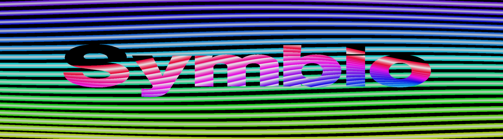

# Raster Bars Demo

A Three.js demo that creates a classic demoscene-style raster bars effect with a centered "Symbio" logo. The demo features independently controlled raster bars for both background and text, with real-time parameter adjustment.

This project is part of a series of experiments in LLM-assisted code generation, developed entirely through conversation with Claude (Anthropic's Claude-3-Sonnet) using the Cursor editor.



## Features

- Independent raster bar controls for background and text
- Real-time parameter adjustment via GUI controls
- Smooth sine wave animations with configurable offsets
- Gradient coloring with adjustable brightness
- Centered 3D text with complementary colors
- Responsive design that adapts to window size

## Development Process

This project demonstrates the capabilities of Large Language Models in creative coding:
- Complete implementation generated through natural language conversation
- Iterative refinement of shaders and controls
- Real-time problem solving and debugging
- Complex 3D graphics and shader programming
- Interactive parameter tuning and optimization

The entire codebase, including:
- GLSL shaders
- Three.js setup and integration
- GUI controls
- Parameter optimization
was developed through conversation with Claude-3-Sonnet.

## Controls

### Background Bars
- Number of bars: 11 (range: 1-24)
- Animation speed: 0.53 (range: 0.1-2.0)
- Bar offset: 0.28 (range: 0.05-0.5)
- Bar thickness: 0.01 (range: 0.005-0.05)
- Brightness: 0.2 (range: 0.2-1.0)
- Sine offset: 0.46 (range: 0.0-1.0)

### Text Bars
- Number of bars: 5 (range: 1-24)
- Animation speed: 0.89 (range: 0.1-2.0)
- Bar offset: 0.2 (range: 0.05-0.5)
- Bar thickness: 0.02 (range: 0.005-0.05)
- Brightness: 0.2 (range: 0.2-1.0)
- Sine offset: 0.4 (range: 0.0-1.0)

### Color Settings
- Color shift: 1.0 (range: 0.0-1.0)

## Technical Details

### Stack
- Three.js for 3D rendering
- GLSL shaders for the raster bar effect
- dat.GUI for real-time controls
- Vite as the development server and bundler

### Implementation Details
- Uses orthographic camera for consistent 2D-style rendering
- Independent shader parameters for text and background
- HSV to RGB color conversion in shaders
- World position based rendering for text bars
- UV coordinate based rendering for background bars
- Depth-aware rendering with proper transparency

### Project Structure
```
project-root/
├── src/
│   ├── main.js           # Main application entry point
│   ├── shaders/
│   │   ├── background.frag  # Background raster bars shader
│   │   ├── background.vert  # Background vertex shader
│   │   ├── text.frag        # Text raster bars shader
│   │   └── text.vert        # Text vertex shader
│   └── style.css         # Basic styling
├── index.html            # HTML entry point
├── package.json          # Project dependencies
└── vite.config.js       # Vite configuration
```

## Installation

### Local Development

1. Clone the repository:
```bash
git clone https://github.com/yourusername/raster-bars-demo.git
cd raster-bars-demo
```

2. Install dependencies:
```bash
npm install
```

3. Start the development server:
```bash
npm run dev
```

4. Open your browser and navigate to `http://localhost:5173`

### GitHub Pages Deployment

1. Add these scripts to your package.json:
```bash
"scripts": {
  "dev": "vite",
  "build": "vite build",
  "preview": "vite preview",
  "deploy": "gh-pages -d dist"
}
```

2. Install gh-pages package:
```bash
npm install --save-dev gh-pages
```

3. Add base URL to vite.config.js:
```js
export default defineConfig({
  base: '/raster-bars-demo/', // Replace with your repo name
  // ... other config options
})
```

4. Build and deploy:
```bash
npm run build
npm run deploy
```

5. On GitHub:
   - Go to your repository settings
   - Navigate to "Pages"
   - Select "gh-pages" branch as source
   - Save changes

The demo will be available at: `https://yourusername.github.io/Rasterbars`

## Usage

1. The demo will start automatically with default parameters
2. Use the GUI controls in the top-right corner to adjust parameters:
   - Expand/collapse sections by clicking on the folders
   - Drag sliders to adjust values
   - Double-click values to enter them manually
   - Click the close button to hide the GUI

